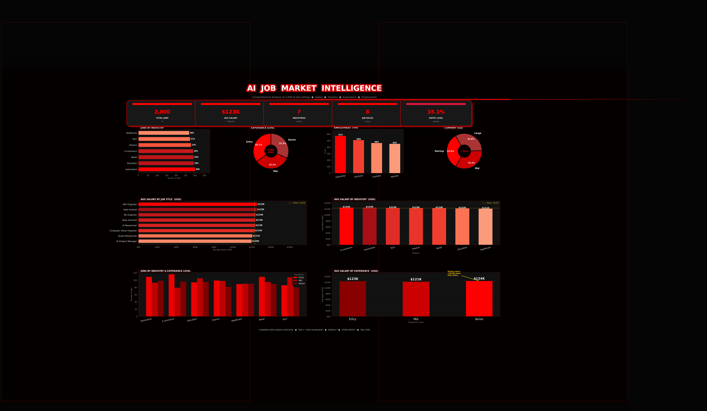

# 📊 Data Visualization - AI Job Market Dashboard

## 🖼️ Dashboard Preview


## 🎯 Project Overview
Transformed 2,000 AI job listings into a premium visual dashboard
using Python, Matplotlib and Seaborn.

## 💡 Key Insights
| Metric | Value |
|--------|-------|
| Total Jobs | 2,000 |
| Avg Salary | $123K/year |
| Top Industry | Automotive (300 jobs) |
| Highest Paying Role | NLP Engineer - $125K |
| Most Common Level | Entry (35.1%) |

## 📈 Charts in Dashboard
| Chart | Insight |
|-------|---------|
| Jobs by Industry | Automotive leads with 300 jobs |
| Experience Level | Entry level dominates at 35.1% |
| Employment Type | Internship most common (574) |
| Company Size | Evenly distributed across all sizes |
| Avg Salary by Job Title | NLP Engineer highest at $125K |
| Avg Salary by Industry | E-commerce pays most at $125K |
| Jobs by Industry & Experience | Grouped breakdown |
| Avg Salary by Experience | Senior earns most at $124K |

## 🛠️ Tools Used
- Python 3
- Matplotlib
- Pandas
- NumPy

## ▶️ How to Run
```bash
pip install pandas matplotlib numpy
python Task3_Visualization.py
```

## 📁 Files
| File | Description |
|------|-------------|
| [Task3_Visualization.py](Task3_Visualization.py) | Main script |
| [ai_job_market.csv](ai_job_market.csv) | Dataset |
| [task3_AI_dashboard.png](task3_AI_dashboard.png) | Output |

---
**CodeAlpha Data Analytics Internship | Task 3 | Rejitha E | CA/DF1/85415**
